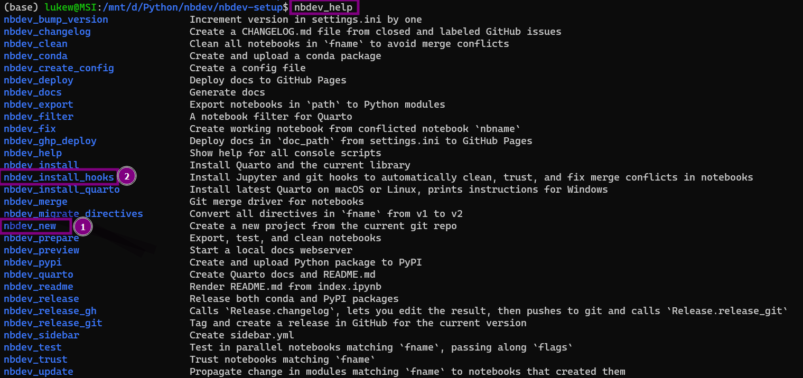

📒 `nbdev-setup`
================

<!-- WARNING: THIS FILE WAS AUTOGENERATED! DO NOT EDIT! -->

#### Official Documentation

Tutorial: https://nbdev.fast.ai/tutorial.html  
Youtube: https://www.youtube.com/watch?v=67FdzLSt4aA (65 mins)

## Instructions

1.  Create a **new repo on github** and clone locally

2.  **Install nbdev**

-   `pip install nbdev` \* Linux/WSL only (as of Aug 2022)  
    \* Note: pip install does work on windows, but some commands
    (i.e. doc building with `Quarto`) are unix only.

3.  Create 📒 **nbdev project** from current repo  

-   `nbdev_new`  
-   settings.ini should update automatically with github config values.

4.  Install **git and Jupyter hooks** for git-friendly notebooks  

-   `nbdev_install_hooks`
-   `nbdev_install_quarto` local documents

Use `nbdev_help` for command list



## Development

Quick access command:

> `nbdev_prepare`  
> `nbdev_docs`  
> git add -A; git commit -m’check in files’; git push

Run **`jupyter notebook`** and add code using `export` tags

-   i.e. 📑 \[notebooks/00_core.ipynb\]

## 🏗️ `nbdev_prepare`

command bundles the following

1.  🏗️ nbdev_export: Builds the .py modules and library from the jupyter
    notebook
2.  🛠️ nbdev_test: Tests all your notebooks
3.  🚿 nbdev_clean: Cleans your notebooks to get rid of extreanous
    output for Github

📝 To build docs from notebooks (including README.md from `index.ipynb`)

> nbdev_docs

#### Install module locally using pip:

``` python
!pip install -e .
```

    Obtaining file:///mnt/d/Python/nbdev/nbdev-setup
    Installing collected packages: nbdev-setup
      Attempting uninstall: nbdev-setup
        Found existing installation: nbdev-setup 0.0.1
        Uninstalling nbdev-setup-0.0.1:
          Successfully uninstalled nbdev-setup-0.0.1
      Running setup.py develop for nbdev-setup
    Successfully installed nbdev-setup-0.0.1

#### To use module inline:

``` python
from nbdev_setup.core import *
```

``` python
hello_player('Luke')
```

    'Hello Luke! From 00_core.ipynb'

# 🃏 Playing Cards

Found in `00_core.ipynb` which compiles into `nbdev_setup/core.py`

``` python
from nbdev.showdoc import *
```

    The autoreload extension is already loaded. To reload it, use:
      %reload_ext autoreload

``` python
from nbdev_setup.core import Card, Deck
```

------------------------------------------------------------------------

### Deck

>      Deck (jokers=True)

A deck of 54 cards, including two jokers.

-   Source code exported from `00_core.ipynb`
-   Located in `core.py`

``` python
import inspect
print(inspect.getsource(Deck))
```

    class Deck:
        "A deck of 54 cards, including two jokers."
        def __init__(self, jokers=True):
            self.cards = [Card(suit=s, rank=r) for s in range(4) for r in range(1,14)]
            if jokers:
                self.cards.append(Card(suit=4, rank=None))
                self.cards.append(Card(suit=4, rank=None))
                
        def __str__(self):
            ret = f"Deck ({len(self.cards)})\n"
            cardlist = "".join([f"{card}; " for card in self.cards])
            return ret + cardlist
        __repr__ = __str__
        
        def __len__(self):
            return len(self.cards)
        
        def shuffle(self):
            random.shuffle(self.cards)
            
        def take_card(self):
            return self.cards.pop()
        
        def draw_n(self, n:int):
            hand = []
            for card in range(n):
                hand.append(self.take_card())
            return hand

# ♤ ♥ ♢ ♧ ♤ ♡ ♢ ♧

#### Initialise playing deck:

``` python
deck = Deck(jokers=True)
deck
```

    Deck (54)
    2♠; 3♠; 4♠; 5♠; 6♠; 7♠; 8♠; 9♠; 10♠; J♠; Q♠; K♠; A♠; 2♣; 3♣; 4♣; 5♣; 6♣; 7♣; 8♣; 9♣; 10♣; J♣; Q♣; K♣; A♣; 2♦; 3♦; 4♦; 5♦; 6♦; 7♦; 8♦; 9♦; 10♦; J♦; Q♦; K♦; A♦; 2♥; 3♥; 4♥; 5♥; 6♥; 7♥; 8♥; 9♥; 10♥; J♥; Q♥; K♥; A♥; 🃏; 🃏; 

#### Shuffle deck and take a card:

``` python
deck.shuffle()
c = deck.take_card()
c
```

    9♣

#### Draw hands

``` python
deck = Deck()
deck.shuffle()

h1, h2, h3 = deck.draw_n(5), deck.draw_n(5), deck.draw_n(5)

print(h1, h2, h3, sep="\n")
```

    [10♣, 9♣, 5♠, 7♦, A♣]
    [5♥, 🃏, 2♦, 6♦, J♠]
    [Q♠, K♣, J♣, 2♣, 🃏]
